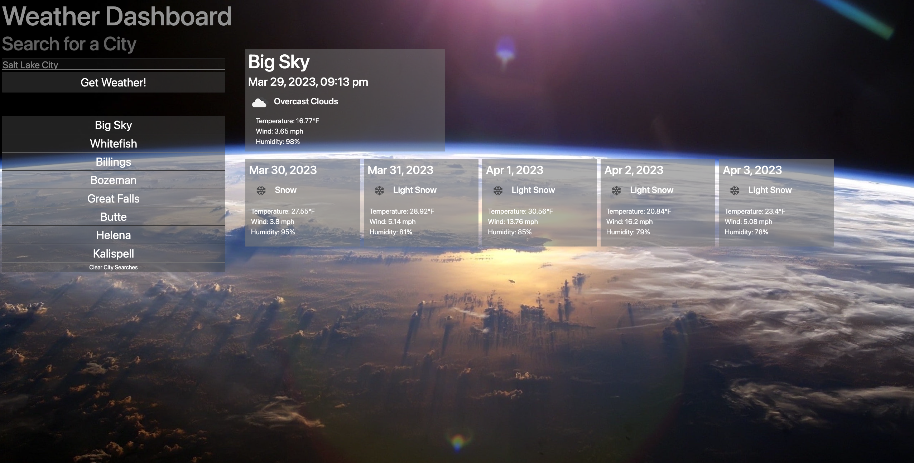

# parker-brook-weather-dashboard-challenge06
Repo for Challenge 06 - Weather Dashboard

## Description
This project is a weather dashboard that user's can utilize to find both the current weather conditions as well as the five day forecast for any given city. City searches are saved in local storage and are displayed to the user as clickable buttons, allowing them to easily revisit a searched city without having to manually type it again.

Link to deployed app: https://pbodybrooks.github.io/parker-brook-weather-dashboard-challenge06/

## Screenshot

## Installation
N/A

## Credits
MDN/W3 Schools

## License
Please refer to repo.

## Features
This project features a weather dashboard that uses two different API calls to fetch and return weather and forecast data for an entered city. City searches are saved using local storage, and a separate function creates and displays a list of buttons to re-search that city. It was built using HTML, CSS, and Javascript with bootstrap and some jQuery. 